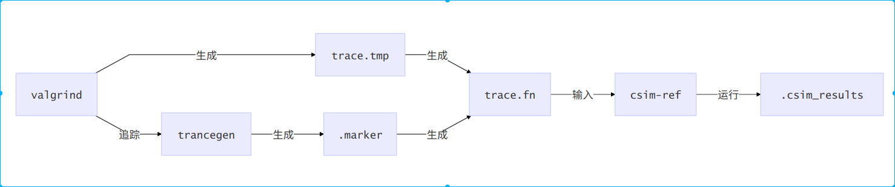

# CMU CacheLab实验

### 1. 实验源文件详解

* **cachelab.c**：CacheLab功能函数源码文件

  * **`printSummary`**：打印Cache模拟结果，包括命中次数、缺失次数、替换次数

  * **`initMatrix`**：初始化两个矩阵，用于第二个实验

  * **`randMatrix`**：随机生成一个矩阵，试验中没有用到

  * **`correctTrans`**：正确转置函数，被第二个实验validate函数调用用于验证优化后的转置函数是否正确

  * **`rigisterTransFunction`**：注册转置函数，根据传入的转置函数指针以及函数描述字符串注册函数，并将该函数的cache模拟结果成员变量以及是否正确转置位初始化(hits，misses，evitions，correct)。

* **cachelab.h**：cachelab.c头文件，包括函数定义以及注册函数结构体定义

* **csim.c**：实验一文件，根据存放程序对数据的访问记录的输入文件内容，模拟cache，获得模拟结果

  * **变量解析**
    * **`verbosity`**：是否输出每一行记录的命中、缺失、替换情况，一般用于bug测试
    * **`s`**：组索引组号位宽
    * **`b`**：cache每一行存放的数据位宽，即块内偏移位宽
    * **`E`**：关联度，即每组的行数，每组内是全相联
    * **`trace_file`**：数据访问追踪记录文件路径
    * **`S`**：组索引组数，由位宽计算得到
    * **`cache`**：模拟cache的一个二维数组，根据组号以及组内行号确定一行cache
    * **`set_index_mask`**：用于获得组号的一个mask
  * **函数解析**
    * **`initCache`**：根据S，E创建cache数据，并初始化set_index_mask
    * **`freeCache`**：回收cache模拟数组空间
    * **`accessData`**：根据传入地址，模拟访问一次数据，更新模拟结果
    * **`replayTrace`**：根据trace文件模拟整个数据访问，有的记录需要两次访问数据
    * **`printUsage`**：打印帮助信息
    * **`main`**：处理传入的参数，将参数传入函数，依次调用initCache、replayCache、freeCache、printSummary模拟Cache

* **trans.c**：实验二文件，存放多个转置函数，包括需要提交的函数(根据函数描述来确定是否未提交的结果函数)

  ​	       还包括注册函数，将多个转置函数注册到实验二测试集合中

  * **`is_transpose`**：判断是否转置成功，但是所有代码中都没用到该函数，应该是编写trans时的测试函数
  * **`transpose_submit`**：最终提交的你的转置优化函数，最终算分也是根据这个函数的测试结果算分，其对应的函数描述为Transpose submission
  * **`trans`**：最简单的没有任何优化的转置函数，函数描述为Simple row-wise scan transpose
  * **`registerFunctions`**：注册所有转置函数，可以自行添加新的转置函数用于中间测试

* **tracegen.c**：跟踪记录文件生成 根据转置函数对数据的访问生成数据访问记录文件，这样csim就可以根据文件模拟，输出的MARKER_START、MARKER_END的地址，输出文件名为.marker

  * **变量解析**
    * **`func_list`**：转置函数列表，用于存放每个转置函数的入口地址、函数描述、正确性以及模拟结果，从cachelab.c中extern得到

    * **`func_counter`**：注册的转置函数个数，从cachelab.c文件extern得到

    * **`MAKER_START、MARKER_END`**：volatile类型，每次访问都要直接访存，所以在调用转置函数前后分别对MARKER_START、MARKER_END进行访问，这样在追踪的时候就可以根据MARKER_START、MARKER_END确定转置函数的追踪记录(因为追踪是对整个程序进行追踪)

    * **`A`**：待转置矩阵

    * **`B`**：转置结果矩阵

    * **`M`**：矩阵列数

    * **`N`**：矩阵行数

  * **函数解析**
    * **`validate`**：调用correctTrans获得A对应正确转置结果矩阵，并和B进行对比判断优化的转置函数是否正确

    * **`main`**：处理命令行参数，依次调用registerFunctions、initMatrix、fprintf(输出MARKER_START、MARKER_END的地址)、调用命令行参数指定的转置函数(调用前后要访问MARKER_START、MARKER_END)

* **test-trans.c**：用于实验二测试每个注册的转置函数，并输出cache模拟结果

  * **`eval_perf`**：评估表现函数，评估注册的转置函数的性能

    ​	**`执行的流程`​**：

    * 循环测试每个注册的转置函数，首先调用tracegen函数测试当前循环转置函数，用valgrind命令对程序进行追踪

      这样会获得整个tracegen函数的跟踪记录trace.tmp以及标记文件.marker

    * trace.tmp文件会有所有数据访问的结果，但是由于tracegen程序在调用转置前后访问了volatile变量MARKER_START、MARKER_END，所以在转置函数的数据访问跟踪记录前后会有MARKER_START、MARKER_END的跟踪记录，根据.marker文件中MARKER_START、MARKER_END在运行的时候的数据地址就可以定位一个访问区间，这个区间内的访问记录就是转置函数的数据跟踪记录，但是有指令的访问记录，所以只要将区间内指令的访问记录删除就可以获得转置函数的数据访问记录，将该记录输出到trace.fn文件(n为当前当前测试转置函数编号)		

    * 调用csim-ref根据trace.fn跟踪文件模拟cache以测试转置函数表现，并根据这个输出结果，csim-ref与自己写的csim区别在于它不仅是正确的cache模拟程序，还将模拟结果输出到了件.csim_results，这样在调用完csim-ref程序之后，当前循环后面的代码可以读取这个文件获得运行结果用以评估表现

  * **`uasge`**：帮助信息输出函数

  * **`sigsegv_handler`**：SEGSEGV信号处理函数，处理段错误

  * **`sigalrm_handler`**：SIGALRM信号处理函数，处理超时错误

  * **`main`**：处理命令行参数，包括矩阵大小以及是否显示帮助信息然后会安装信号处理函数，处理子程序错误，并设置时钟，以防子程序死循环或者发生段错误，然后会调用eval_perf函数对所有注册的函数进行评估，并最后输出结果

### 2. 实验一执行流程解析

1. 运行test-csim测试csim
2. 运行csim的执行文件，传入不同的参数，根据traces文件夹下的各个追踪文件模拟cache，与csim-ref的正确结果进行比对并输出结果。

### 3. 实验二执行流程

 1. 运行test-trans，测试命令行制定的矩阵大小

 2. 对每个注册函数进行测试，文件流程

3. 每次测试输出测试结果

### 4. driver.py执行流程

1. 运行test-csim测试实验一，获得实验一分数，共八个样例，除最后一个样例6分其他均3分

   > linux> ./csim -s 1 -E 1 -b 1 -t traces/yi2.trace
   >
   > linux> ./csim -s 4 -E 2 -b 4 -t traces/yi.trace
   >
   > linux> ./csim -s 2 -E 1 -b 4 -t traces/dave.trace
   >
   > linux> ./csim -s 2 -E 1 -b 3 -t traces/trans.trace
   >
   > linux> ./csim -s 2 -E 2 -b 3 -t traces/trans.trace
   >
   > linux> ./csim -s 2 -E 4 -b 3 -t traces/trans.trace
   >
   > linux> ./csim -s 5 -E 1 -b 5 -t traces/trans.trace
   >
   > linux> ./csim -s 5 -E 1 -b 5 -t traces/long.trace

2. 运行test-trans测试实验二，获得实验二分数，共三个样例

   > 32×32：如果m<300得8分，如果m>600得0分，对其他m得(600-m)\*8/300分。
   >
   > 64×64：如果m<1300得8分，如果m>2000得0分，对其他m得(2000-m)\*8/700分。
   >
   > 61×67：如果m<2000得10分，如果m>3000得0分，对其他m得(3000-m)\*10/1000分。

3. 计算两个实验得分得到总分，共53分