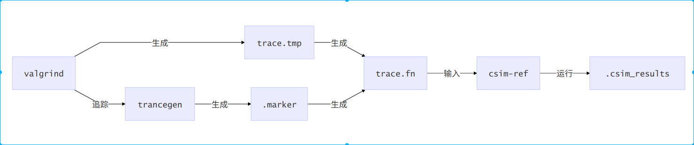
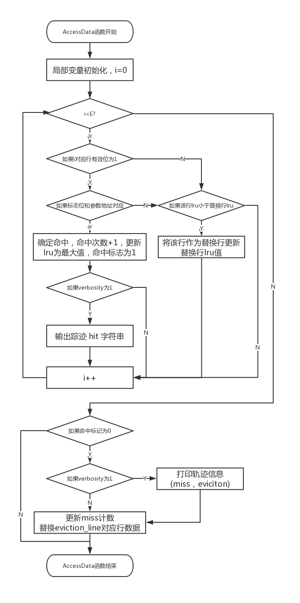
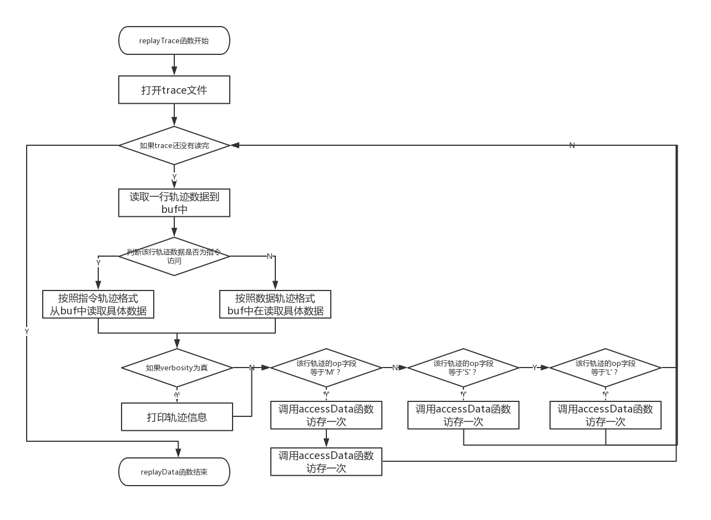
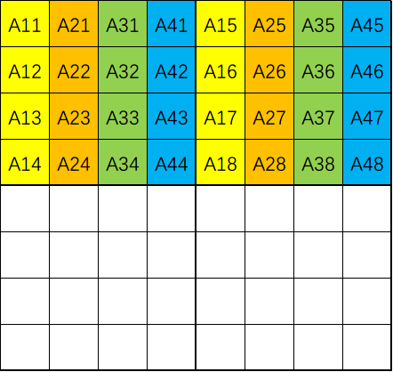
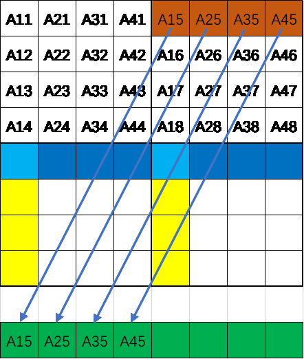
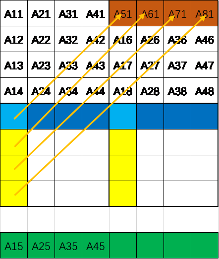
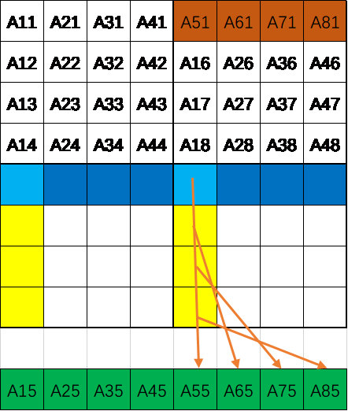
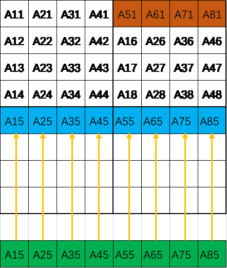
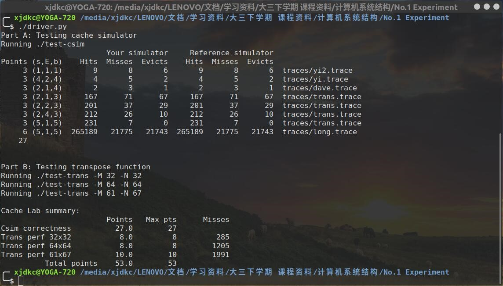

##  前言

　　最近做了一下CMU的CacheLab实验，感觉实验的整个C语言项目写得十分不错，以及实验考察内容十分有价值，特别是实验二中对64×64规模矩阵的优化令人称赞，加上好久没有更新博文了:cry:，于是想写一篇博文介绍一下，也方便日后回顾。本篇博文算是对与实验报告的归纳总结。

## 实验要求

### 实验一要求

　　在第一部分中，需要实现一个Cache模拟器，根据输入的trace文件中对于各个数据的访问情况来模拟整个Cache的工作，其中trace文件是linux下valgrind工具获得。

* 在csim.c提供的程序框架中编写实现一个Cache模拟器，输入为内存访问轨迹trace文件，程序的功能需要模拟缓存相对内存访问轨迹的命中/缺失行为，输出为命中、缺失和缓存行淘汰/驱逐的总数。
* 完成的csim.c文件生成的可执行程序结果应与参考存储模拟器csim-ref在相同的命令行参数下产生一致的输出结果
* 模拟器必须在输入参数s、E、b设置为任意值时均能正确工作——即需要使用malloc函数（而不是代码中固定大小的值）来为模拟器中数据结构分配存储空间。
* 由于实验仅关心数据Cache的性能，因此模拟器应忽略所有指令cache访问（即轨迹中“I”起始的行）
* 假设内存访问的地址总是正确对齐的，即一次内存访问从不跨越块的边界——因此可忽略访问轨迹中给出的访问请求大小
* main函数最后必须调用printSummary函数输出结果，并如下传之以命中hit、缺失miss和淘汰/驱逐eviction的总数作为参数：

  > printSummary(hit_count, miss_count, eviction_count);

### 实验二要求

　　在第二部分中，需要完成矩阵转置的优化，由于Cache是对于局部性较好的程序性能更好，所以需要优化常规的矩阵转置程序让Cache的命中数尽可能的高而缺失以及替换次数尽可能的低。
　　实验的具体目的以及要求为：在trans.c中编写实现一个矩阵转置函数transpose_submit，要求其在参考Cache模拟器csim-ref上运行时对不同大小的矩阵均能最小化缓存缺失的数量。该函数的输入为两个二维数组A、B，函数的功能是将A进行矩阵转置后将结果存放到B中。
　　对于实现的限制要求有：

* 	限制对栈的引用——在转置函数中最多定义和使用12个int类型的局部变量，同时不能使用任何long类型的变量或其他位模式数据以在一个变量中存储多个值。原因是实验测试代码不能/不应计数栈的引用访问，而应将注意力集中在对源和目的矩阵的访问模式上。
* 不允许使用递归。如果定义和调用辅助函数，在任意时刻，从转置函数的栈帧到辅助函数的栈帧之间最多可以同时存在12个局部变量。例如，如果转置函数定义了8个局部变量，其中调用了一个使用4个局部变量的函数，而其进一步调用了一个使用2个局部变量的函数，则栈上总共将有14个变量，则违反了本规则。 
* 转置函数不允许改变矩阵A，但可以任意操作矩阵B。
* 不允许在代码中定义任何矩阵或使用malloc及其变种。

　　实验的测试数据有三组，在实验中可能针对这三种数据规模的数据进行特殊优化。

## 实验环境

|     项目     |                版本                |
| :----------: | :--------------------------------: |
|   操作系统   |       Ubuntu 18.04 LTS 64位        |
|    编译器    | Ubuntu 7.4.0-1ubuntu1~18.04) 7.4.0 |
|     make     |            GNU Make 4.1            |
| 内存调试工具 |          valgrind-3.13.0           |
|  版本管理器  |         git version 2.21.0         |

## 实验源文件详解

### cachelab.c

　　CacheLab功能函数功能源码文件。结构体及函数如下：

  * **`printSummary`**：打印Cache模拟结果，包括命中次数、缺失次数、替换次数
  * **`initMatrix`**：初始化两个矩阵，用于第二个实验
  * **`randMatrix`**：随机生成一个矩阵，试验中没有用到
  * **`correctTrans`**：正确转置函数，被第二个实验validate函数调用用于验证优化后的转置函数是否正确

  * **`rigisterTransFunction`**：注册转置函数，根据传入的转置函数指针以及函数描述字符串注册函数，并将该函数的cache模拟结果成员变量以及是否正确转置位初始化(hits，misses，evitions，correct)。

### cachelab.h

　　cachelab.c头文件，包括函数定义以及注册函数结构体定义。

### csim.c

　　实验一文件，根据存放程序对数据的访问记录的输入文件内容，模拟cache，获得模拟结果。变量与函数解析如下：
  * **变量解析**
    * **`verbosity`**：是否输出每一行记录的命中、缺失、替换情况，一般用于bug测试
    * **`s`**：组索引组号位宽
    * **`b`**：cache每一行存放的数据位宽，即块内偏移位宽
    * **`E`**：关联度，即每组的行数，每组内是全相联
    * **`trace_file`**：数据访问追踪记录文件路径
    * **`S`**：组索引组数，由位宽计算得到
    * **`cache`**：模拟cache的一个二维数组，根据组号以及组内行号确定一行cache
    * **`set_index_mask`**：用于获得组号的一个mask
  * **函数解析**
    * **`initCache`**：根据S，E创建cache数据，并初始化set_index_mask
    * **`freeCache`**：回收cache模拟数组空间
    * **`accessData`**：根据传入地址，模拟访问一次数据，更新模拟结果
    * **`replayTrace`**：根据trace文件模拟整个数据访问，有的记录需要两次访问数据
    * **`printUsage`**：打印帮助信息
    * **`main`**：处理传入的参数，将参数传入函数，依次调用initCache、replayCache、freeCache、printSummary模拟Cache

### trans.c

　　实验二文件，存放多个转置函数，包括需要提交的函数(根据函数描述来确定是否未提交的结果函数)，还包括注册函数，将多个转置函数注册到实验二测试集合中。

  * **`is_transpose`**：判断是否转置成功，但是所有代码中都没用到该函数，应该是编写trans时的测试函数
  * **`transpose_submit`**：最终提交的你的转置优化函数，最终算分也是根据这个函数的测试结果算分，其对应的函数描述为Transpose submission
  * **`trans`**：最简单的没有任何优化的转置函数，函数描述为Simple row-wise scan transpose
  * **`registerFunctions`**：注册所有转置函数，可以自行添加新的转置函数用于中间测试

### tracegen.c

　　跟踪记录文件生成 根据转置函数对数据的访问生成数据访问记录文件，这样csim就可以根据文件模拟，输出的MARKER_START、MARKER_END的地址，输出文件名为.marker。
  * **变量解析**
    * **`func_list`**：转置函数列表，用于存放每个转置函数的入口地址、函数描述、正确性以及模拟结果，从cachelab.c中extern得到
    * **`func_counter`**：注册的转置函数个数，从cachelab.c文件extern得到
    * **`MAKER_START、MARKER_END`**：volatile类型，每次访问都要直接访存，所以在调用转置函数前后分别对MARKER_START、MARKER_END进行访问，这样在追踪的时候就可以根据MARKER_START、MARKER_END确定转置函数的追踪记录(因为追踪是对整个程序进行追踪)
    * **`A`**：待转置矩阵
    * **`B`**：转置结果矩阵
    * **`M`**：矩阵列数
    * **`N`**：矩阵行数
  * **函数解析**
    * **`validate`**：调用correctTrans获得A对应正确转置结果矩阵，并和B进行对比判断优化的转置函数是否正确
    * **`main`**：处理命令行参数，依次调用registerFunctions、initMatrix、fprintf(输出MARKER_START、MARKER_END的地址)、调用命令行参数指定的转置函数(调用前后要访问MARKER_START、MARKER_END)。

### test-trans.c

　　用于实验二测试每个注册的转置函数，并输出cache模拟结果。
 * **`eval_perf`**：评估表现函数，评估注册的转置函数的性能

    ​	**`执行的流程`​**：

    * 循环测试每个注册的转置函数，首先调用tracegen函数测试当前循环转置函数，用valgrind命令对程序进行追踪
      这样会获得整个tracegen函数的跟踪记录trace.tmp以及标记文件.marker
    * trace.tmp文件会有所有数据访问的结果，但是由于tracegen程序在调用转置前后访问了volatile变量MARKER_START、MARKER_END，所以在转置函数的数据访问跟踪记录前后会有MARKER_START、MARKER_END的跟踪记录，根据.marker文件中MARKER_START、MARKER_END在运行的时候的数据地址就可以定位一个访问区间，这个区间内的访问记录就是转置函数的数据跟踪记录，但是有指令的访问记录，所以只要将区间内指令的访问记录删除就可以获得转置函数的数据访问记录，将该记录输出到trace.fn文件(n为当前当前测试转置函数编号)		
    * 调用csim-ref根据trace.fn跟踪文件模拟cache以测试转置函数表现，并根据这个输出结果，csim-ref与自己写的csim区别在于它不仅是正确的cache模拟程序，还将模拟结果输出到了件.csim_results，这样在调用完csim-ref程序之后，当前循环后面的代码可以读取这个文件获得运行结果用以评估表现
  * **`uasge`**：帮助信息输出函数
  * **`sigsegv_handler`**：SEGSEGV信号处理函数，处理段错误
  * **`sigalrm_handler`**：SIGALRM信号处理函数，处理超时错误
  * **`main`**：处理命令行参数，包括矩阵大小以及是否显示帮助信息然后会安装信号处理函数，处理子程序错误，并设置时钟，以防子程序死循环或者发生段错误，然后会调用eval_perf函数对所有注册的函数进行评估，并最后输出结果

## 程序执行流程

### 实验一执行流程

1. 运行test-csim测试csim
2. 运行csim的执行文件，传入不同的参数，根据traces文件夹下的各个追踪文件模拟cache，与csim-ref的正确结果进行比对并输出结果。

### 实验二执行流程

1. 运行test-trans，测试命令行制定的矩阵大小
2. 对每个注册函数进行测试，文件流程



3. 每次测试输出测试结果

### driver.py执行流程

1. 运行test-csim测试实验一，获得实验一分数，共八个样例，除最后一个样例6分其他均3分

   > linux> ./csim -s 1 -E 1 -b 1 -t traces/yi2.trace
   >
   > linux> ./csim -s 4 -E 2 -b 4 -t traces/yi.trace
   >
   > linux> ./csim -s 2 -E 1 -b 4 -t traces/dave.trace
   >
   > linux> ./csim -s 2 -E 1 -b 3 -t traces/trans.trace
   >
   > linux> ./csim -s 2 -E 2 -b 3 -t traces/trans.trace
   >
   > linux> ./csim -s 2 -E 4 -b 3 -t traces/trans.trace
   >
   > linux> ./csim -s 5 -E 1 -b 5 -t traces/trans.trace
   >
   > linux> ./csim -s 5 -E 1 -b 5 -t traces/long.trace

2. 运行test-trans测试实验二，获得实验二分数，共三个样例

   > 32×32：如果m<300得8分，如果m>600得0分，对其他m得(600-m)\*8/300分。
   >
   > 64×64：如果m<1300得8分，如果m>2000得0分，对其他m得(2000-m)\*8/700分。
   >
   > 61×67：如果m<2000得10分，如果m>3000得0分，对其他m得(3000-m)\*10/1000分。

3. 计算两个实验得分得到总分，共53分

## 实验思路

### 实验一思路

　　在第一部分中，需要修改的文件只有csim.c。在该文件中，包含的函数有：

* void initCache()
* void initCache()
* void freeCache()
* void accessData(mem_addr_t addr)
* void replayTrace(char* trace_fn)
* void printUsage(char* argv[])
* int main(int argc, char* argv[])

　　其中csim.c文件已经完成了初始化Cache的initCache函数、打印帮助信息的printUsage函数以及整个程序执行流程的main函数，在main函数中包含了对于命令行参数的解析以及对于各个函数的调用。需要完成的函数只有释放Cache空间的freeCache函数、模拟访问数据的accessData函数以及根据输入trace文件重现数据访问过程的replayTrace。
　　在本实验中设计到的数据存储结构为cache_line结构体，其存储内容为Cache一行的辅助信息位，由于是模拟并没有存放具体数据，包含有效位valid、标志信息位(数据地址)tag、LRU算法计数位lru。在该程序框架中可以看出是通过二维数据的方式模拟一个组相联的Cache，所以创建了一个该结构体的二维数组。
　　首先需要完成的就是释放为了模拟Cache而开辟空间，即freeCache函数，根据initCache源码可以知道，该二维数组是通过一个指针数据实现的，所以每一组存放的位置是连续的，但是组与组之间存放的位置并不连续，在释放的时候也需要对每一组进行单独释放。
　　接下来需要实现的是对于一次数据访问的模拟，即完成accessData函数。采取的实现思路是首先遍历一遍输入的数据地址对应的Cache组，即遍历组内E行Cache行，在遍历时候如果有效位为真则说明是有效的，此时判断标记位是否符合输入的地址，如果是那么就命中，否则就说明是其他数据则更新lru计数位；如果有效位不为真，说明是空闲位，说明可以用空闲位进行替换。在遍历时候记录下替换位，即lru计数位最小的位就是需要替换的位(因为当命中后会将lru置为最大，更新是每次减一)。遍历完之后如果方式缺失则根据替换信息位将需要替换的那一行信息更新为输入的数据地址对应的信息。在整个函数实现的过程中还需要根据verbosity位决定是否显示轨迹信息。本设计思路只需要遍历一遍，时间上较为有效率。具体流程图如下图所示：



　　最后需要完成的就是重新整个数据的访问过程，即完成replayTrace函数，在该函数中主要是分析读入的trace文件，由于每一行表示操作一次数据，所以只需要对每一行进行同样的处理即可，通过循环即可完成。每一行数据的格式为：	

> **[0-1 space] operation address,size**

* Operation(操作)：内存访问的类型。I - 指令装载，L - 数据装载，S - 数据存储，M - 数据修改(即数据装载后接数据存储)
* address：所64-bit十六进制内存地址

* size：访问的内存字节数量

　　需要注意的是对于I指令由于在本实验中不考虑对于指令的模拟，知识针对数据Cache的一个模拟，所以在输入文件中已经过滤掉了对于指令的轨迹数据。对于M指令，由于是一个修改指令所以是读取了依次数据修改后存放回回去，所以这一条指令其实是房村了两次，所以要调用两次accessData函数。具体流程图实现如下图所示：


### 实验二思路

　　由于是针对矩阵转置的一个优化，所以需要知道原来的程序不好的地方在哪里。在trans.c程序中已经完成了一个简单的矩阵转置函数，函数描述为“Simple row-wise scan transpose”，其实现原理就是通过两重循环完成对应矩阵的转置。在这个程序中，其不足的地方有：

* B数组不同行之间的Cache替换：由于是先读取A矩阵的一行存放到B矩阵的一列，那么存放到B矩阵的一列时，由于数据存放是按照行优先所以需要访问B中每一行前面的数据，也就是说要将每一行前面的数据都要加载到Cache中。但是Cache的行数是有限的，能够存放的不同的B数组行的行数是有限的，如果存放不下B的所有行，当需要访问B的后面的行是就会将原来的B的行替换出来造成依次替换，而由于每一列B都要经历这个过程，所以说每一次B的数据访问都会造成一次替换，Cache的效率很低。

* A数组与B数组之间的Cache替换：Cache中不仅存放了B数组的数据，还存放了A数组的数据以及一些函数的局部变量的数据，所以在访问B的某一个数据时，如果与Cache中A的数据属于同一组同一行那么A的数据就会被替换出去，再次访问A的时候就会再次造成缺失。

　　以上两点就是trans.c中未优化的矩阵转置函数的缺点，按照理想情况来讲，如果数据不存在替换的情况，即后面的数据不会替换前面还未访问完的数据时，Cache只会在第一次加载数据的时候产生一次缺失而不会有后面的那么多次不希望看到的替换，所以需要解决这两点。
　　在这之前，先来看一下程序以及输入的数据，在整个程序框架中通过读取源码可以发现测试程序采用的参数为s=5，E=1，b=5，也就是说采取了直接相连的方式，每组内行数只有一行。测试的三个矩阵的大小分别为32\*32，64\*64，61\*67。
　　首先针对第一个不足之处，为了避免B数组后面的某一行数据将前面还未访问完毕的某一行数据进行替换，就需要缩小转置的范围，即让一次转置的行数减少，所以要根据矩阵的大小以及Cache的大小来计算B数组间隔多少行会产生数据属于同一组的情况。首先一个整型变量的大小为4B，一行Cache的存储的数据位数为5b，也就是25即32个字节，也就是说一行Cache能够存放8个整型变量，同理由于Cache的组数的位数为5，能够存放的行数为32行，那么对于实验测试的Cache每间隔32\*8个整型变量的数据就属于同一行，如果在一次循环中读取了这样的两行机会发生替换造成Cache缺失数大量提升，所以需要将每次处理的数据控制在256个整型变量以内，对于32\*32的矩阵，每一行有32个整型变量，所以每间隔256/32=8行就会发生如上所说的情况，所以需要将矩阵大小控制在8\*8以内，以8\*8规模的矩阵逐步转置32\*32的矩阵，最终将其完全转置；对于64\*64的矩阵，则是每间隔4行就会发生如上所述情况。对于61\*67的矩阵，由于矩阵本身大小并不是2的次方，所以间隔8行的数据并不会发生替换，因为不是属于同一组，而Cache能够存放的行数还是较多的，只要不是存放在同一行Cache能够存放下更多的数据，所以可以将每次转置的矩阵规模变大一些保证不超过32的前提下找一个合适的值就可以了，在本设计中取的值是16。

　　对于第二个不足之处，即如果存在A和B的数据存放在同一组的情况时，如果需要访问其中一个的数据就会造成替换，采取的解决办法是通过临时变量的方式进行中转。结合第一个不足之处的解决方案，只讨论8\*8的情况，因为所有的转置都是按照8\*8的大小重复进行的。在矩阵的行数以及列数一定的情况下，只有对角线上的元素才会存在在A、B对应位置的数据属于同一组的情况，因为对角线上数据不论按行优先还是列优先计算偏移，对于行数和列数一样的矩阵来说其偏移量都是一样的，所以需要对含有对角线元素的矩阵进行特殊处理。处理的方式是通过临时变量的方式，在转置的过程中，外层循环是8\*8矩阵的行号，内层循环是8\*8矩阵的列号，转置A的一行的时候，如果直接将A对角线上元素赋值给B的对角线上元素时，B的对应块就会把A的该行替换掉，然后在A之后的赋值中又得替换回来，所以采取的方式是用临时变量暂存A对角线元素，然后待该行循环结束之后再赋值给B的对应位置，这个时候B还是会替换掉A的该行，但是已经不影响了，因为A该行的其他变量都已经赋值给B对应的位置了。

　　对于32\*32和61\*67的实现代码如下：

```C++
for (i=0;i<N;i+=SQUARE_SIDE(N))
    for (j=0;j<M;j+=SQUARE_SIDE(N))
    {
        for (k=i;k<min(i+SQUARE_SIDE(N),N);k++)
        {
            for (l=0;l<min(SQUARE_SIDE(N),M-j);l++)
                if (k != j+l)
                    B[j+l][k]=A[k][j+l];
                else
                    temp[0]=A[k][j+l];
            if (i==j)
                B[k][k]=temp[0];
        }
    }
```

　　对于32\*32的测试，每一个8\*8的缺失次数为(8+8)=16次，理想情况下不考虑与局部变量的冲突替换以及其他代码的数据访问总的缺失次数为16\*4\*4=256，加上其他原因导致的数据访问缺失，预计缺失次数应小于300符合题目要求。
　　对于64\*64的测试，按照之前的计算，应该按照4\*4的大小对64\*64的矩阵进行转置，但是这又出现了一个新的问题，即由于每次只使用了A的一块中的4个整型变量，那么在第二次使用的时候就不得不重新加载新的整型变量了，同理每次只存放了4列B值，那么同一块中还有4个整型变量没有被赋值，所以下次使用的时候仍需要重新加载到Cache中，造成替换替换次数仍较多。
　　解决这个问题的方法就是用B的空间暂存A的数据，对于8\*8的矩阵，将前4行A的数据全部赋值给B前4行的某些变量，这样之后就不用再次用到A的前4行了。然后用A的后四行以及B的前4行中暂存数据更新更新B的后4行并将B的前4行更新，但是要注意由于B的第i+4行会替换掉B的第i行，所以需要先将数据取出来并赋值成正确的值，然后再更新B的第i+4行，这样由于不会用到B的第i行了所以第i+4行替换第i行不会造成多余的替换。具体分为4步：

1.  将A左上角转置赋值给B左上角，将A右上角转置赋值给B右上角将A的右上角转置后并没有像之前那样直接赋值给B的左下角因为跨了4行访问B中元素会造成多余的替换，所以用B的右上角暂存，这样也不用再访问A了，完成后的状态图如图2.1所示。这一步会缺失8次，即A的前四行以及B的前四行数据访问的Cache缺失。



2.  将B右上角的第i行后4个整型存储到temp数组前4个整型，其中temp数据为B第i行的正确转置后的数据。如图2.2所示



3. 将A的第i列后4个整型变量赋值给B第i行后4个变量，具体的状态如图2.3所示。可以看到已经完成了B矩阵第i行的数据的正确赋值，但是还没有访问B的第i+4行，所以目前只多缺失了4次即A的后4行替换前4行的四次。



4. 将A第i+4列后4个整型赋值给temp数组的后四个整型，也可以不通过temp数组直接赋值但是对于对角线来说会造成缺失。所以还是存放到temp中，temp由于一直在使用，所有不会被替换出去除了与A、B某一块的数据访问冲突时。这里不会造成新的缺失。这一步的的状态图如图2.3所示。



5. 将temp数组所有8个整型赋值给B第i+4行。这次赋值会造成Cache的缺失，即B的第i+4行会替换掉B的第i行，但是由于B的第i行已经完成转置了所以之后用不到了也就不存在缺失了。具体的状态图如图2.5所示。



　　重复2-5步骤直到将完成A的转置，在不考虑A、B之外的数据Cache冲突的情况下，8\*8块的转置的总的缺失次数为(4+4+4+4)=16次，对于64\*64的矩阵来说，理想情况下的缺失次数为16\*8\*8=1024，加上可能与局部变量之间的冲突以及除了转置函数循环之外的代码的数据访问，总的数据访问缺失次数应小于1300，预计符合题目要求。

　　根据以上设计，书写代码完成对于64\*64大小矩阵的优化，最终优化代码如下：

```C++
for (i=0;i<N;i+=8)
    for (int j=0;j<M;j+=8)
    {
        for (int k=i;k<i+4;k++)
        {
            for (l=0;l<8;l++)
                temp[l]=A[k][j+l];
            for (l=0;l<4;l++)
            {
                B[j+l][k] = temp[l];
                B[j+l][k+4] = temp[l+4];
            }
        }
        for (int k=j+4;k<j+8;k++)
        {
            for (l=0;l<4;l++)
                temp[l]=B[k-4][i+l+4];
            for (l=4;l<8;l++)
                temp[l]=A[i+l][k];

            for (l=4;l<8;l++)
                B[k-4][i+l]=A[i+l][k-4];
            for (l=0;l<8;l++)
                B[k][i+l]=temp[l];
        }
}

```

## 测试结果

　　运行python driver.py进行总体测试，结果如图所示。



## 后记

　　完整的代码点击[Github](https://github.com/XJDKC/University-Code-Archive/tree/master/Course%20Experiment/Computer%20Architecture%20Course%20Exp)查看。